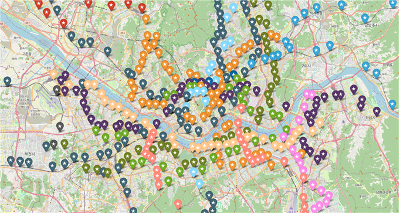
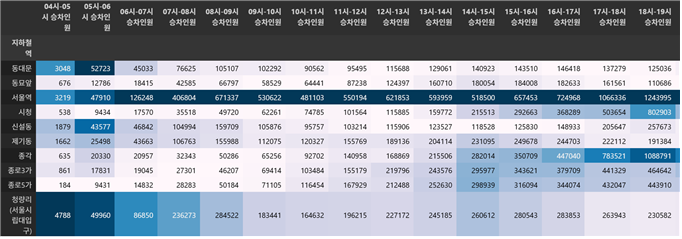
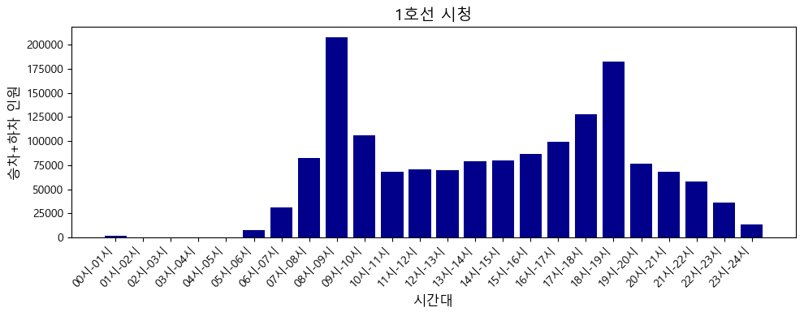
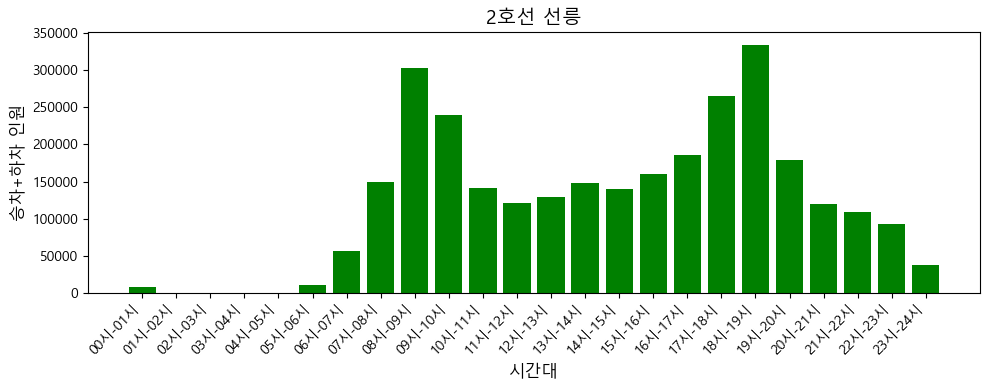
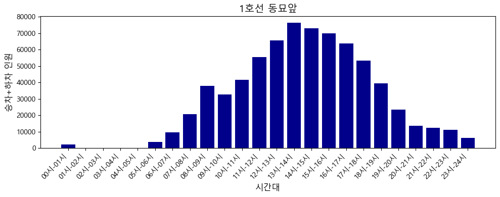
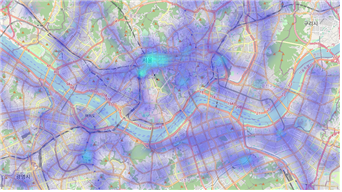
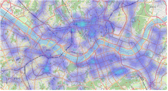

# 서울시 지하철 승하차 데이터 분석

서울시 **호선별 · 역별 · 시간대별 지하철 승하차 인원** 공공데이터(2025년 1~5월)를 분석해, 어느 역에 · 어느 시간대에 이용객이 몰리는지 지도 위 히트맵으로 시각화한 2인 프로젝트입니다.

| 항목 | 내용 |
|---|---|
| 데이터 | 서울 열린데이터광장 「서울시 지하철 호선별 역별 시간대별 승하차 인원 정보」 |
| 분석 기간 | 2025년 1월 ~ 5월 (시간대별 애니메이션은 2025년 5월) |
| 기술 | Python, pandas, Google Maps Geocoding API(`googlemaps`), folium (`HeatMap`, `HeatMapWithTime`), Streamlit |
| 역할 | **조건** — 데이터 수집 · 전처리 · 역 좌표 수집 · 분석 · 지도 시각화 (`subway.ipynb` 전체) / 팀원 — Streamlit 웹 화면 (`web/`) |

## 분석 흐름

```
원본 CSV (호선 · 역 · 시간대별 승하차 인원)
  │
  ├─ 1. 데이터 확인 ── 구조 · 결측치 확인
  │
  ├─ 2. 역 좌표 수집 ── 역 이름 + "역" → Google Geocoding API로 위도 · 경도 수집
  │                    같은 이름의 다른 역(양평역: 5호선 / 중앙선) · 좌표를 못 찾은 역
  │                    (삼성(무역센터)역 등 괄호가 붙은 역 이름)은 직접 좌표 입력
  │                    → folium 지도에 노선별 색으로 역 표시, 좌표 CSV 저장
  │
  ├─ 3. 기간 필터 ──── 2025년 1~5월 데이터만 사용
  │
  └─ 4. 분석 · 시각화
       ├─ 호선별 · 역별 5개월 누적 승차 / 하차 순위 (27개 노선)
       ├─ 역별 시간대별 승차+하차 인원 막대그래프 (2025년 5월, 노선 색으로 구분)
       ├─ 역별 하루 평균 승차 / 하차 인원 히트맵 (월별 일수로 나눠 일평균 계산)
       └─ 2025년 5월 시간대별 승차 / 하차 애니메이션 히트맵 (04시부터 다음 날 04시까지 1시간 단위)
```

## 주요 내용

**역 좌표 수집과 정제**
- 원본 데이터에는 좌표가 없어, 역 이름으로 Google Geocoding API를 호출해 27개 노선 621개 역(역 이름 기준 529개)의 위도 · 경도를 수집했습니다.
- `양평역`처럼 이름은 같지만 노선이 다른 역, `삼성(무역센터)역`처럼 괄호가 붙어 검색에 실패한 역(11곳)은 좌표를 직접 찾아 넣었습니다.

<p align="center"></p>
<p align="center"><sub>수집한 좌표로 그린 역 지도 (folium, 노선별 색 마커) · 배경 지도 © OpenStreetMap contributors</sub></p>

**좌표 병합 문제 해결**
- 처음 히트맵을 만들 때 승하차 데이터와 좌표 데이터의 역 이름 형식이 달라(`강남` / `강남역`, 앞뒤 공백), 병합이 한 역에서만 성공하고 그 좌표가 여러 번 중복되는 문제가 있었습니다.
- 역 이름 끝에 `역`을 붙여 형식을 통일하고, 공백 제거 · 중복 역 제거 · 좌표 숫자형 변환 후 결측 제거를 거쳐 해결했습니다. 최종적으로 527개 지점이 히트맵에 표시됩니다.

**호선별 · 역별 이용객 순위**
- 5개월 누적 승차 · 하차 인원을 호선별 · 역별로 집계하고, pandas `background_gradient`로 시간대별 값의 크기를 색으로 표시했습니다.

<p align="center"></p>
<p align="center"><sub>1호선 역별 · 시간대별 누적 승차 인원 (2025년 1~5월) — 서울역 · 종각 · 시청의 출퇴근 시간대가 짙게 표시됨</sub></p>

**역별 시간대 이용 패턴**
- 2025년 5월 데이터로 역마다 시간대별 승차+하차 인원을 막대그래프로 그려, 역의 성격에 따라 이용 패턴이 다르다는 점을 확인했습니다.
- 시청 · 선릉처럼 업무 지구의 역은 출근(08~09시)과 퇴근(18~19시)에 뚜렷한 두 봉우리가 나타나고, 동묘앞처럼 시장 · 상권 중심의 역은 낮 시간(13~15시)에 이용객이 가장 많습니다.

<p align="center">
  
  
  
</p>
<p align="center"><sub>2025년 5월 시간대별 승차+하차 인원 · 왼쪽부터 1호선 시청 · 2호선 선릉 · 1호선 동묘앞</sub></p>

**히트맵**
- 역별 하루 평균 승하차 인원을 가중치로 한 `HeatMap`으로 이용객이 많은 지역을 표시했습니다.

<p align="center">
  
  
</p>
<p align="center"><sub>역별 하루 평균 승차(왼쪽) · 하차(오른쪽) 히트맵 (2025년 1~5월) · 배경 지도 © OpenStreetMap contributors</sub></p>

- 시간대별 승하차 인원을 프레임으로 한 `HeatMapWithTime`으로, 출퇴근 시간에 이용객이 몰리는 지역이 바뀌는 모습을 애니메이션으로 보여 줍니다.

**웹 화면 (팀원 담당)**
- Streamlit 멀티페이지 앱으로 분석 결과를 제공합니다: 홈(노선도) · 시간별 승하차 애니메이션 히트맵 · 역별 하루 평균 승하차 히트맵 · 1호선 역을 누르면 해당 역의 시간대별 승차 인원 막대그래프

## 폴더 구성

```
Seoul_subway_data_analytic/
├── data/
│   ├── 서울교통공사_역주소_위경도.csv      지오코딩으로 만든 역 좌표 (노선 · 역 이름 · 위도 · 경도)
│   └── 서울시 지하철 호선별 역별 시간대별 승하차 인원 정보_202501까지.csv
│                                           원본에서 2025년 1~5월만 추출한 분석용 데이터 (3,104행)
├── docs/                               README 그림
├── web/                                Streamlit 웹 화면 (팀원 담당)
│   ├── line1.py                            1호선 역별 시간대별 승차 그래프
│   ├── subwayweb.py                        앱 진입점 (페이지 구성)
│   ├── 승차 인원 정보.py                    시간별 승차 애니메이션 히트맵
│   ├── 역별 하루 평균 승차.py                역별 하루 평균 승차 히트맵
│   ├── 역별 하루 평균 하차.py                역별 하루 평균 하차 히트맵
│   ├── 하차 인원 정보.py                    시간별 하차 애니메이션 히트맵
│   └── 홈페이지.py                          홈 화면
├── README.md
├── requirements.txt
├── subway.ipynb                        데이터 전처리 · 좌표 수집 · 분석 · 히트맵 생성 (최신, 역별 시간대 막대그래프 포함)
└── subway1.ipynb                       이전 버전 (역별 시간대 막대그래프 제외)
```

## 실행 방법

```bash
pip install -r requirements.txt
cd web
streamlit run subwayweb.py
```

- 2025년 1~5월 분석용 CSV와 역 좌표가 `data/`에 포함되어 있어, API 키 없이도 분석 · 히트맵 부분을 실행할 수 있습니다. 전체 기간 원본 CSV(약 27MB)는 용량 문제로 제외했으며 서울 열린데이터광장에서 받을 수 있습니다.
- 코드의 파일 경로는 작업한 PC의 로컬 경로이므로, 실행하려면 본인 환경에 맞게 바꿔야 합니다.
- 좌표 수집에는 Google Maps API 키가 필요합니다 (코드에는 가려 두었습니다).
